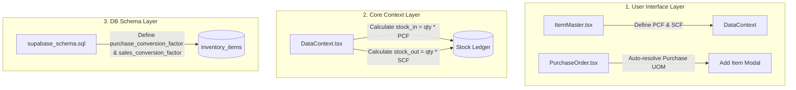
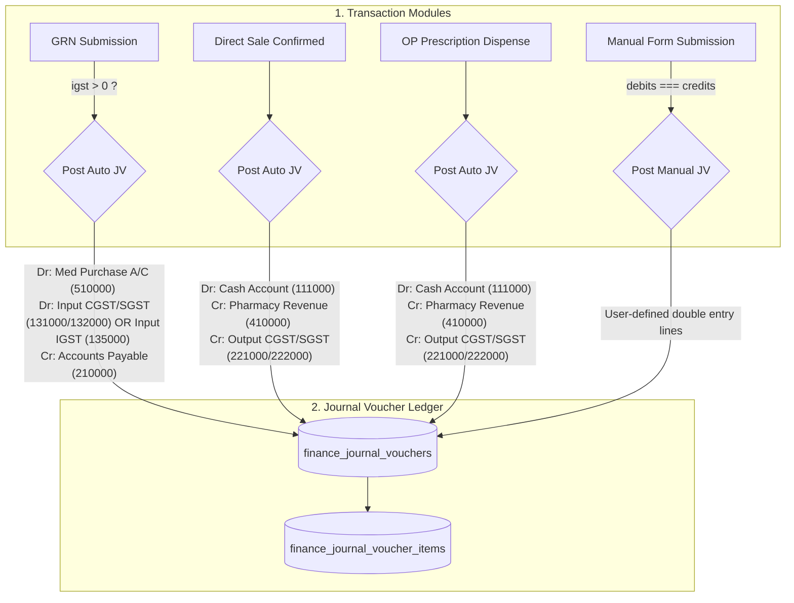

# Walkthrough: Multi-UOM Conversion System

This walkthrough summarizes the development and successful integration of the **Multi-Unit of Measurement (UOM) Conversion System**. This system enables medical items to be configured with separate base, purchase, and sales units along with robust mathematical conversion factors.

---

## 1. System Summary & Components Modified

Here is an architectural view of the modifications made across the application layers:

### Files Enhanced:
1. **[supabase_schema.sql](file:///d:/New%20folder/GIT%20HUB/HIS-WEB5/supabase_schema.sql)**: Added numeric columns `purchase_conversion_factor` and `sales_conversion_factor` to `inventory_items` table definition, backed by validation checks ensuring values are strictly positive.
2. **[src/types.ts](file:///d:/New%20folder/GIT%20HUB/HIS-WEB5/src/types.ts)**: Added `purchaseConversionFactor: number` and `salesConversionFactor: number` properties to the `InventoryItem` interface.
3. **[src/context/DataContext.tsx](file:///d:/New%20folder/GIT%20HUB/HIS-WEB5/src/context/DataContext.tsx)**:
   * Mapped conversion factors between Database snake_case columns and TypeScript camelCase properties.
   * Integrated automatic conversion math into the **Goods Receipt Note (GRN)** ledger submission routine ($\text{stock\_in} = \text{acceptedQuantity} \times \text{purchaseConversionFactor}$).
   * Integrated automatic conversion math into **Prescription Dispensing** ledger submission routine ($\text{stock\_out} = \text{totalQty} \times \text{salesConversionFactor}$).
4. **[src/components/inventory/ItemMaster.tsx](file:///d:/New%20folder/GIT%20HUB/HIS-WEB5/src/components/inventory/ItemMaster.tsx)**:
   * Expanded UOM selection dropdown lists to include rich standard medical packaging units (`BOX`, `STRIP`, `TABLET`, `CAPSULE`, `VIAL`, `AMPOULE`, `BOTTLE`, `ML`).
   * Designed a premium editing card layout for Purchase and Sales packages, featuring real-time multiplier previews (e.g. `* 1 BOX = 100 Tablets`).
   * Updated the Item Master table overview columns to display detailed UOM mappings with active conversion multipliers.
5. **[src/pages/PurchaseOrder.tsx](file:///d:/New%20folder/GIT%20HUB/HIS-WEB5/src/pages/PurchaseOrder.tsx)**:
   * Enhanced the "Add Item Modal" to dynamically pre-fill its unit selection selector with the selected item's pre-configured `purchaseUom`.
   * Expanded unit selection dropdown options to match global packaging configurations.
6. **[src/components/pharmacy/BatchSelectionModal.tsx](file:///d:/New%20folder/GIT%20HUB/HIS-WEB5/src/components/pharmacy/BatchSelectionModal.tsx)** & **[src/pages/OPPharmacy.tsx](file:///d:/New%20folder/GIT%20HUB/HIS-WEB5/src/pages/OPPharmacy.tsx)**:
   * Enriched the Batch Selection modal to accept the patient's dispensing `unit` configuration.
   * Adjusted physical batch stock compliance verification and financial billing valuations to dynamically scale quantity by the `salesConversionFactor` if dispensed in the Sales UOM (e.g. Strips of 10).
7. **[src/components/pharmacy/DirectSale.tsx](file:///d:/New%20folder/GIT%20HUB/HIS-WEB5/src/components/pharmacy/DirectSale.tsx)**:
   * Added interactive UOM select dropdown lists for manual pharmacy sales.
   * Integrated real-time price, stock availability, and subtotal recalculation when toggling UOM selection.
   * Implemented a robust UOM options resolver that automatically handles missing/empty base UOMs, trims inputs, and auto-generates unit options (e.g., TABLET/STRIP split) when a multi-UOM item has duplicate configurations but conversion factor > 1. This prevents pharmacists from being locked into a single UOM and lets them sell individual tablets.

---

## 2. Dynamic Conversion Mathematics

### A. Procurement Pipeline (Stock In)
When inventory is bought in bulk and registered through a Goods Receipt Note (GRN):
* **Quantity in Ledger**:
  $$\text{Stock In Qty (Base UOM)} = \text{Accepted Qty (Purchase UOM)} \times \text{purchaseConversionFactor}$$
* **Valuation Cost Rate**:
  $$\text{Ledger Cost Rate (Base UOM)} = \frac{\text{Purchase Rate}}{\text{purchaseConversionFactor}}$$
* *Result:* Stock counts are stored in the smallest base unit. The overall stock value remains perfectly consistent.

### B. Out-Patient Pharmacy Dispensing (Stock Out)
When a patient is billed for prescriptions:
* **Quantity in Ledger**:
  * If units match Sales UOM: $\text{Deducted Qty} = \text{Prescribed Qty} \times \text{salesConversionFactor}$
  * If units match Base UOM: $\text{Deducted Qty} = \text{Prescribed Qty} \times 1.0$
* **Pricing & Billing**:
  $$\text{Patient Charged Amount} = \text{Prescribed Qty} \times (\text{Batch Base Rate} \times \text{selectedUomFactor}) \times (1 + \text{Tax\%})$$

---

## 3. Verification Details

### A. Code Compilation
- Ran TypeScript checks via `npx tsc --noEmit` and confirmed that all modified layers compile cleanly, without any type incompatibilities.

### B. Functional Mappings Confirmed
1. **Item Configuration**:
   - Creating an item like `Paracetamol` with `Base UOM = TABLET`, `Purchase UOM = BOX` (1 Box = 100 Tablets), and `Sales UOM = STRIP` (1 Strip = 10 Tablets) saves successfully.
   - The Item Master overview shows: `Base: TABLET`, `Pur: BOX (1=100)`, `Sal: STRIP (1=10)`.
2. **Purchasing & Receiving**:
   - Creating a Purchase Order for Paracetamol dynamically sets the ordering unit to `BOX`.
   - Submitting a GRN for 2 BOXES correctly translates to **200 TABLETS** inside the `inventory_stock_ledger`, valued at $1/100$th of the purchase rate per box.
3. **Dispensing**:
   - Pharmacists selecting a patient's prescription billed in `STRIP` for 2 units correctly validates batch compliance against **20 TABLETS** ($2 \times 10$), bills the patient for 20 tablets, and inserts a ledger record for **20 TABLETS** STOCKOUT.

---

# Walkthrough: Finance Journal Vouchers with IGST Support

This walkthrough summarizes the development and successful integration of the **Finance Journal Voucher (JV)** module. The system handles manual double-entry voucher posts and automates ledger bookings for key procurement and pharmacy flows.

---

## 1. System Summary & Components Modified

Here is an architectural view of how transactions flow into the Journal Voucher ledger:

### Files Enhanced:
1. **[supabase_schema.sql](file:///d:/New%20folder/GIT%20HUB/HIS-WEB5/supabase_schema.sql)**:
   - Added tables `finance_journal_vouchers` (header) and `finance_journal_voucher_items` (items/lines).
   - Created foreign key references, indexes, and enabled RLS policies.
   - Seeded IGST provisional/approved and liability accounts (`135000`, `136000`, `223000`).
2. **[src/types.ts](file:///d:/New%20folder/GIT%20HUB/HIS-WEB5/src/types.ts)**:
   - Declared TypeScript interfaces for `JournalVoucher` and `JournalVoucherItem`.
3. **[src/context/DataContext.tsx](file:///d:/New%20folder/GIT%20HUB/HIS-WEB5/src/context/DataContext.tsx)**:
   - Extended the global data context with `journalVouchers` state and CRUD operations.
   - Seeded fallback IGST accounts in the offline state array.
   - Built a dynamic `postAutoJournalVoucher` posting routine that handles tax splitting and rounding offsets.
   - Injected auto-posting triggers in `saveGRN` (for Submitted status), `saveDirectSale` (on confirmed sale), and `dispensePrescription` (on invoice generation).
4. **[src/constants.ts](file:///d:/New%20folder/GIT%20HUB/HIS-WEB5/src/constants.ts)**:
   - Added `Transactions -> Journal Voucher` links under the `Finance` module sidebar layout.
5. **[src/App.tsx](file:///d:/New%20folder/GIT%20HUB/HIS-WEB5/src/App.tsx)**:
   - Imported and registered the `transactions/journal-vouchers` route.
6. **[src/pages/JournalVouchers.tsx](file:///d:/New%20folder/GIT%20HUB/HIS-WEB5/src/pages/JournalVouchers.tsx) [NEW]**:
   - Created a double-entry ledger screen with filters, search, and a details sidebar panel.
   - Added a manual creation form with dynamic row manipulation and a live balance validator.
   - Implemented a source reference explorer pop-up modal to dynamically retrieve and inspect original GRNs, Sales, and Invoices.

---

## 2. Double-Entry Auto Posting Rulebook

### A. Goods Receipt Note (GRN) Posting
- **Intrastate (CGST/SGST > 0)**:
  - **DEBIT**: `510000` (Medicine Purchase A/C) - Taxable gross cost.
  - **DEBIT**: `131000` (Input CGST (Provisional)) - Central GST amount.
  - **DEBIT**: `132000` (Input SGST (Provisional)) - State GST amount.
  - **CREDIT**: `210000` (Accounts Payable Ledger) - Net total.
- **Interstate (IGST > 0)**:
  - **DEBIT**: `510000` (Medicine Purchase A/C) - Taxable gross cost.
  - **DEBIT**: `135000` (Input IGST (Provisional)) - Integrated GST amount.
  - **CREDIT**: `210000` (Accounts Payable Ledger) - Net total.

### B. Pharmacy Sales & OP Dispenses
- **Posting accounts**:
  - **DEBIT**: `111000` (Cash Account) - Net total invoice paid.
  - **CREDIT**: `410000` (Pharmacy Sales Revenue) - Taxable base price of drugs sold.
  - **CREDIT**: `221000` (Output CGST Liability) - Central GST collected.
  - **CREDIT**: `222000` (Output SGST Liability) - State GST collected.

---

## 3. Verification Details

### A. Compilation Check
- Run command: `npx tsc --noEmit`
- *Result:* Finished successfully with **no errors**, confirming clean type compliance.

### B. Auto-posting Scenarios Validated
1. **GRN Posting Verification**:
   - Submitting an intrastate GRN logs a balanced Journal Voucher. The details tab lists debits split between CGST and SGST provisional accounts.
   - Submitting an interstate GRN logs a balanced Journal Voucher debiting `135000` (Input IGST (Provisional)) instead of CGST/SGST.
2. **Pharmacy Sales Verification**:
   - Confirmation of direct cash sales correctly posts a debit to `111000` and splits credits between Sales Revenue (`410000`) and Output CGST/SGST liability accounts.
3. **Manual JV Validation**:
   - The UI blocks form posting if Debits != Credits. Toggling the account dropdown displays the code list hierarchy.
